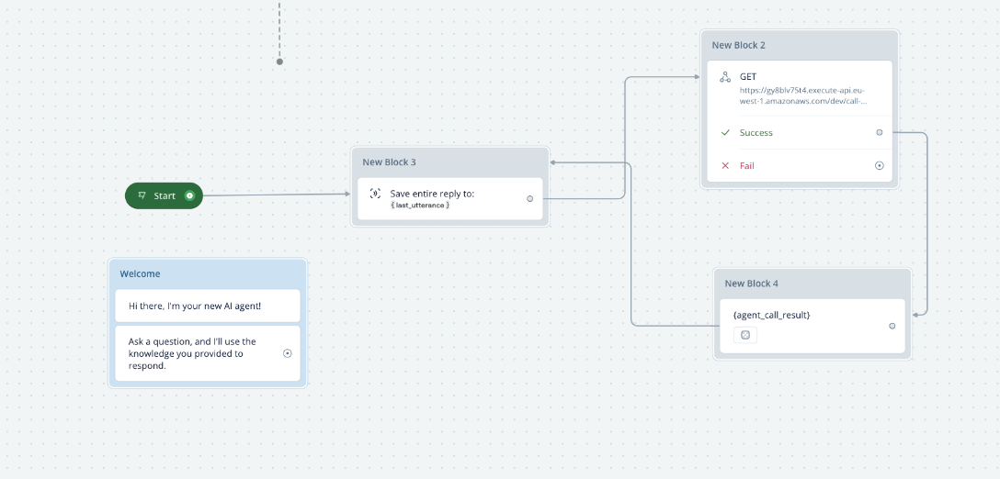

# Lead Generation AI Agent

This is the code for the "Build a Lead Generation AI Agent" tutorial on [YouTube](https://youtu.be/RGEJhcWdXR4).

## Technology Stack and Features

- [**Python**](https://www.python.org) for the logic.
- [**PydanticAI**](https://ai.pydantic.dev/) for the AI agent framework.
- [**Chroma**](https://www.trychroma.com/) for the vector database.
- [**OpenAI**](https://platform.openai.com/) for the AI model.
- [**Airtable**](https://airtable.com/) for the database.
- [**FastAPI**](https://fastapi.tiangolo.com/) for the API.
- [**Docker**](https://www.docker.com/) for the containerization.
- [**AWS**](https://aws.amazon.com/) for the deployment.
- [**Serverless**](https://www.serverless.com/) for the serverless deployment.
- [**Voiceflow**](https://www.voiceflow.com/) for the chatbot widget.

## Environment


### Clone the repository

```bash
git clone https://github.com/JonathanMiz/deploy-lead-gen-agent-yt.git

cd deploy-lead-gen-agent-yt
```

### Create a virtual environment

```bash
python3 -m venv .venv
```

### Activate virtual environment

```bash
source .venv/bin/activate
```

### Install dependencies

```bash
pip3 install -r requirements.txt
```

### Add API keys

Create a file called `.env` in the root directory and add the following:

```
OPENAI_API_KEY=your-api-key

AIRTABLE_API_KEY=your-api-key

AIRTABLE_BASE_ID=your-base-id
```

*Note: don't commit the `.env` file to the repository.*

To get an OpenAI API key, visit [OpenAI](https://platform.openai.com/).

To get an Airtable API key, visit [Airtable](https://airtable.com/account).

## Building the AI Agent

to run the following commands, you need to add the current directory to the python path:

```bash
export PYTHONPATH=$PYTHONPATH:.
```

### Build the vector database

```bash
python3 app/vector_db/build.py
```

### Query the knowledge base

```bash
python3 app/rag.py --query "How much to fix pipe for residential property?"
```

### Run the AI agent

```bash
python3 app/agent.py
```

### Running Server Locally

```bash
python3 app/api.py
```

go to http://0.0.0.0:3030/health to check if the server is running.

test the API by calling the `/call-agent` endpoint with the following query parameters:
http://0.0.0.0:3030/call-agent?user_id=1&query=%22hey%22

## Deployment

### Building the Docker Image

set your values in the `docker/build.sh` file.

then run the following command to build the docker image:

```bash
sudo bash docker/build.sh
```

### Run image locally

```bash
sudo bash docker/run.sh
```

test the API by calling the `/call-agent` endpoint with the following query parameters:
http://0.0.0.0:3030/call-agent?user_id=1&query=%22hey%22

### Deploy to AWS

1. Create an AWS account.
2. Install the AWS CLI.
3. Configure the AWS CLI with your credentials.
4. Create an ECR repository.
5. set your service name in the `docker/deploy.sh` file.
6. set env variables in the AWS SSM parameter store with the same names as in the `AWS_LAMBDA_SERVICE_NAME` file.

then run the following command to deploy the docker image to AWS:

```bash
sudo bash docker/deploy.sh
```

## Embedding Chatbot Widget

1. Create a Voiceflow account.
2. Create a new project.
3. Create the workflow.
4. Change the API endpoint to the AWS Lambda endpoint.
5. Copy and paste the chatbot widget code into `resources/assets/index.html`



### Watch the full step-by-step tutorial

[](https://youtu.be/RGEJhcWdXR4)